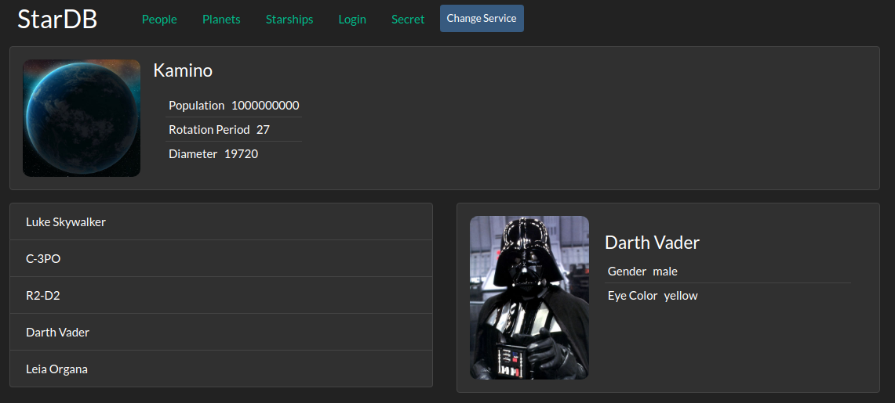

# star-db

The project is a React app to display information about Star Wars using the swapi.dev API

# [Demo](star-db-shakshin.netlify.app)



## Running

```bash
git clone https://github.com/shakshin-01/star-db
npm install
npm start
```

## Features

- Use API swapi.dev
- Use Context API and React Router
- Use High-Order Components (HOC)
- Display random planet
- Display info about people, planets and starships
- Display loading and error indicators
- Catch errors
